###  MEAN STACK DEPLOYMENT TO UBUNTU IN AWS 

> Create an EC2 instance 

> Install NodeJs

> Update ubuntu

    sudo apt update

> Add certificates

    sudo apt -y install curl dirmngr apt-transport-https lsb-release ca-certificates

    curl -fsSL https://deb.nodesource.com/setup_19.x | sudo -E bash -

> Install NodeJS

    sudo apt install -y nodejs

#### STEP 2 INSTALL MONGODB
> Add book records to MongoDB

    wget -qO - https://www.mongodb.org/static/pgp/server-6.0.asc |  gpg --dearmor | sudo tee /usr/share/keyrings/mongodb.gpg > /dev/null

> Create list file for MongoDB

    echo "deb [ arch=amd64,arm64 signed-by=/usr/share/keyrings/mongodb.gpg ] https://repo.mongodb.org/apt/ubuntu jammy/mongodb-org/6.0 multiverse" | sudo tee /etc/apt/sources.list.d/mongodb-org-6.0.list

> Install MonogoDB

    sudo apt update
    sudo apt install mongodb-org

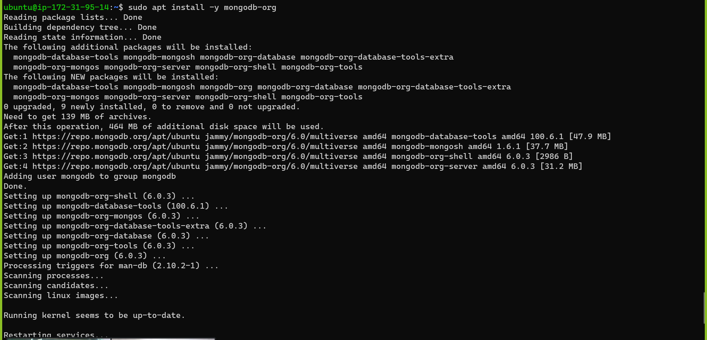

> Check mongodb version

    mongod -version
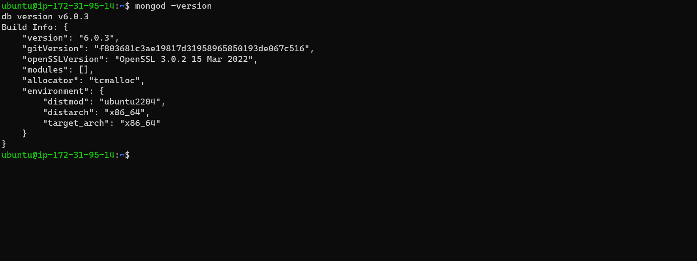

> Start the server

    sudo service mongod start
> Verify the server is up and running

    sudo systemctl status mongod
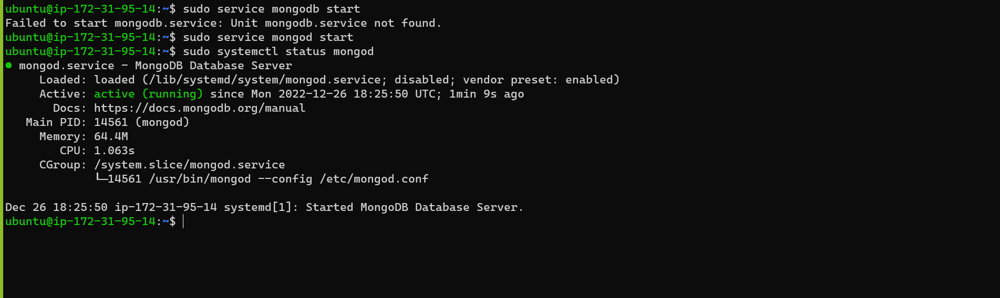

> Install npm -Node package manager

    sudo systemctl status mongod
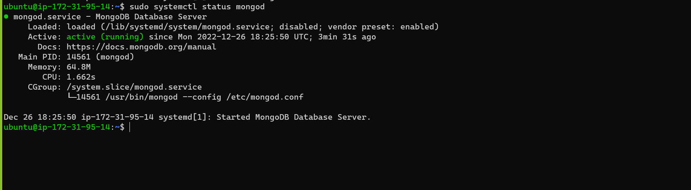

> Create a folder named 'Books'

    mkdir Books && cd Books

> Install body-parser package

    sudo npm install body-parser
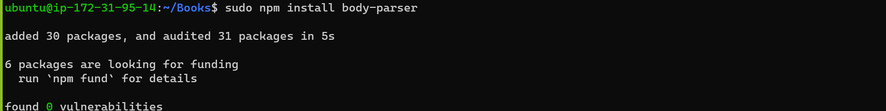
> Initialize npm project

    npm init
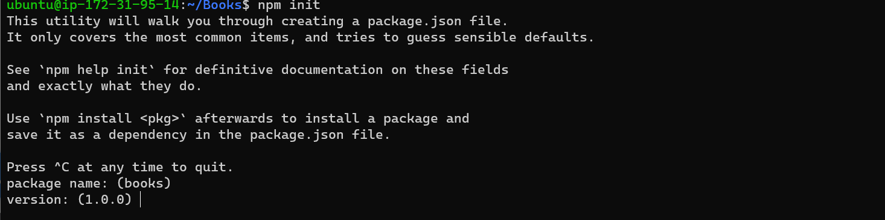
> Add a file named server.js

    var express = require('express');
    var bodyParser = require('body-parser');
    var app = express();
    app.use(express.static(__dirname + '/public'));
    app.use(bodyParser.json());
    require('./apps/routes')(app);
    app.set('port', 3300);
    app.listen(app.get('port'), function() {
    console.log('Server up: http://localhost:' + app.get('port'));
    });
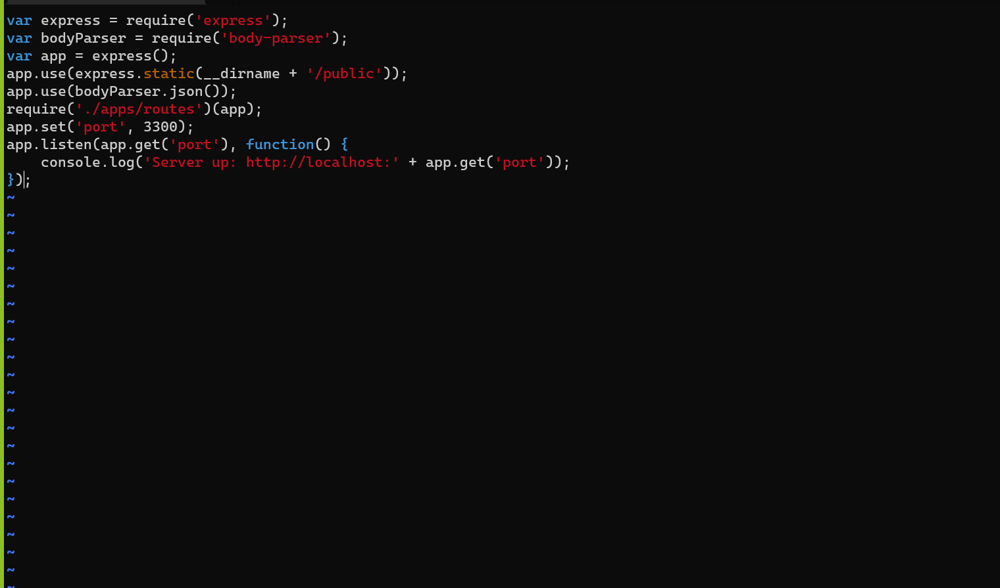

#### INSTALL EXPRESS AND SET UP ROUTES TO THE SERVER
> Install Mongoose

    sudo npm install express mongoose
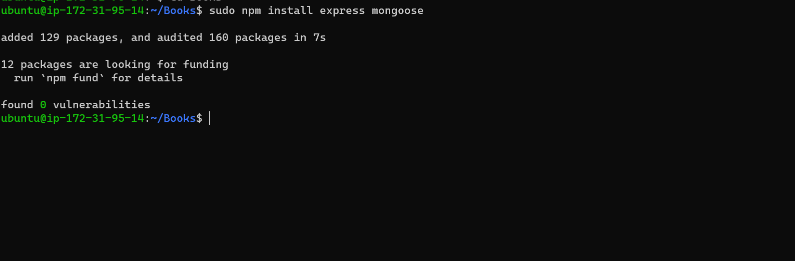

> Create a folder named apps

    mkdir apps && cd apps
> Create a file name routes.js

    vi routes.js
> Paste the following

    var Book = require('./models/book');
    module.exports = function(app) {
    app.get('/book', function(req, res) {
    Book.find({}, function(err, result) {
      if ( err ) throw err;
      res.json(result);
    });
    }); 
    app.post('/book', function(req, res) {
    var book = new Book( {
      name:req.body.name,
      isbn:req.body.isbn,
      author:req.body.author,
      pages:req.body.pages
    });
    book.save(function(err, result) {
      if ( err ) throw err;
      res.json( {
        message:"Successfully added book",
        book:result
      });
    });
    });
    app.delete("/book/:isbn", function(req, res) {
    Book.findOneAndRemove(req.query, function(err, result) {
      if ( err ) throw err;
      res.json( {
        message: "Successfully deleted the book",
        book: result
      });
    });
    });
    var path = require('path');
    app.get('*', function(req, res) {
    res.sendfile(path.join(__dirname + '/public', 'index.html'));
    });
    };
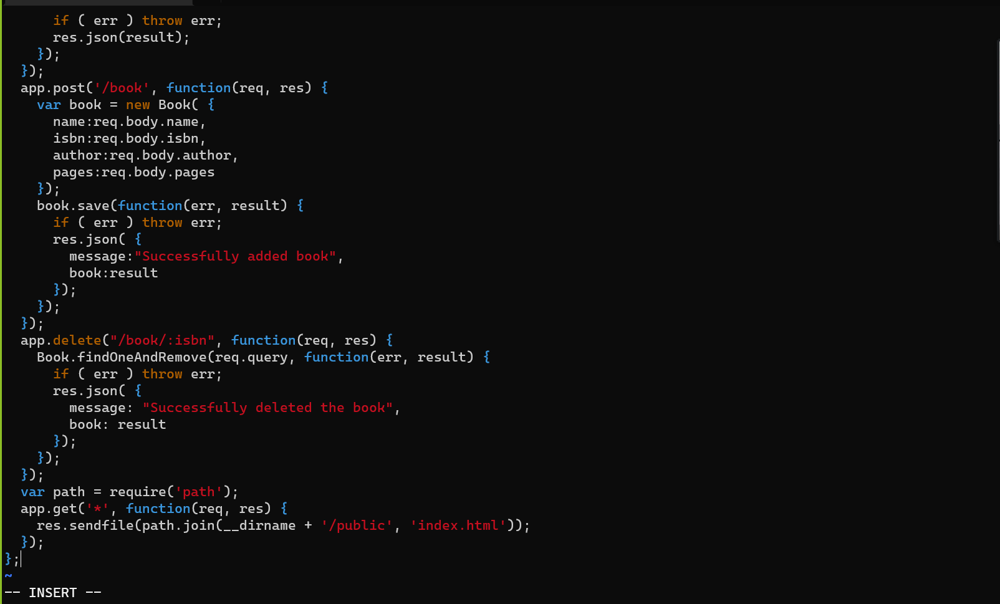

> Create a folder named models

    mkdir models && cd models
> Create a file named book.js
> Paste the below code in it 

```javascript
var mongoose = require('mongoose');
var dbHost = 'mongodb://localhost:27017/test';
mongoose.connect(dbHost);
mongoose.connection;
mongoose.set('debug', true);
var bookSchema = mongoose.Schema( {
  name: String,
  isbn: {type: String, index: true},
  author: String,
  pages: Number
});
var Book = mongoose.model('Book', bookSchema);
module.exports = mongoose.model('Book', bookSchema);
```
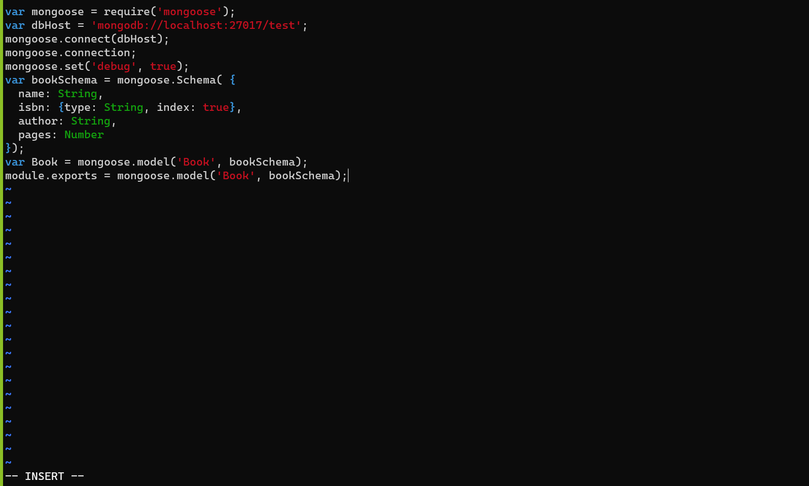

#### STEP 4 ACCESS THE ROUTES WITH ANGULARJS
> Change directory to Books
> Create a folder named public

    mkdir public && cd public
> Add a file named script.js

    var app = angular.module('myApp', []);
    app.controller('myCtrl', function($scope, $http) {
    $http( {
    method: 'GET',
    url: '/book'
    }).then(function successCallback(response) {
    $scope.books = response.data;
    }, function errorCallback(response) {
    console.log('Error: ' + response);
    });
    $scope.del_book = function(book) {
    $http( {
      method: 'DELETE',
      url: '/book/:isbn',
      params: {'isbn': book.isbn}
    }).then(function successCallback(response) {
      console.log(response);
    }, function errorCallback(response) {
      console.log('Error: ' + response);
    });
    };
    $scope.add_book = function() {
    var body = '{ "name": "' + $scope.Name + 
    '", "isbn": "' + $scope.Isbn +
    '", "author": "' + $scope.Author + 
    '", "pages": "' + $scope.Pages + '" }';
    $http({
      method: 'POST',
      url: '/book',
      data: body
    }).then(function successCallback(response) {
      console.log(response);
    }, function errorCallback(response) {
      console.log('Error: ' + response);
    });
    };
    });
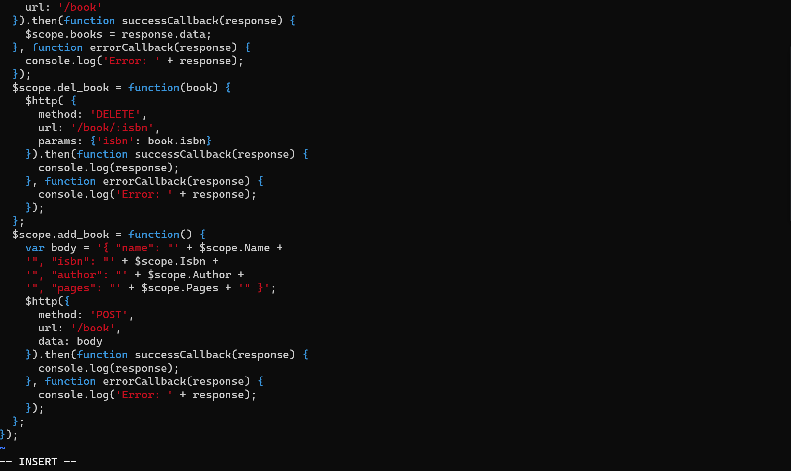

> In public folder create a file named index.html

    vi index.html
> Paste the following in it
```html
<!doctype html>
<html ng-app="myApp" ng-controller="myCtrl">
  <head>
    <script src="https://ajax.googleapis.com/ajax/libs/angularjs/1.6.4/angular.min.js"></script>
    <script src="script.js"></script>
  </head>
  <body>
    <div>
      <table>
        <tr>
          <td>Name:</td>
          <td><input type="text" ng-model="Name"></td>
        </tr>
        <tr>
          <td>Isbn:</td>
          <td><input type="text" ng-model="Isbn"></td>
        </tr>
        <tr>
          <td>Author:</td>
          <td><input type="text" ng-model="Author"></td>
        </tr>
        <tr>
          <td>Pages:</td>
          <td><input type="number" ng-model="Pages"></td>
        </tr>
      </table>
      <button ng-click="add_book()">Add</button>
    </div>
    <hr>
    <div>
      <table>
        <tr>
          <th>Name</th>
          <th>Isbn</th>
          <th>Author</th>
          <th>Pages</th>

        </tr>
        <tr ng-repeat="book in books">
          <td>{{book.name}}</td>
          <td>{{book.isbn}}</td>
          <td>{{book.author}}</td>
          <td>{{book.pages}}</td>

          <td><input type="button" value="Delete" data-ng-click="del_book(book)"></td>
        </tr>
      </table>
    </div>
  </body>
</html>
```
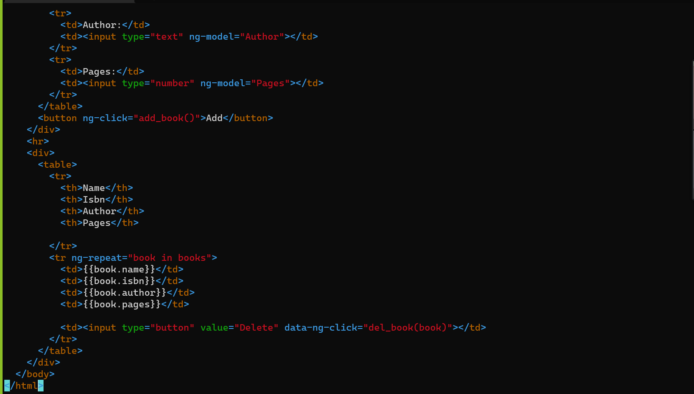

> Change directory to Books
> Start the server by running the following

    node server.js
> on your browser paste the following

    http://44.208.162.231:3300/
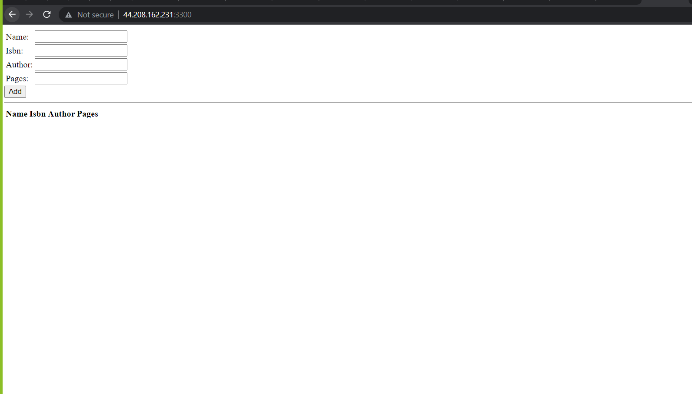

